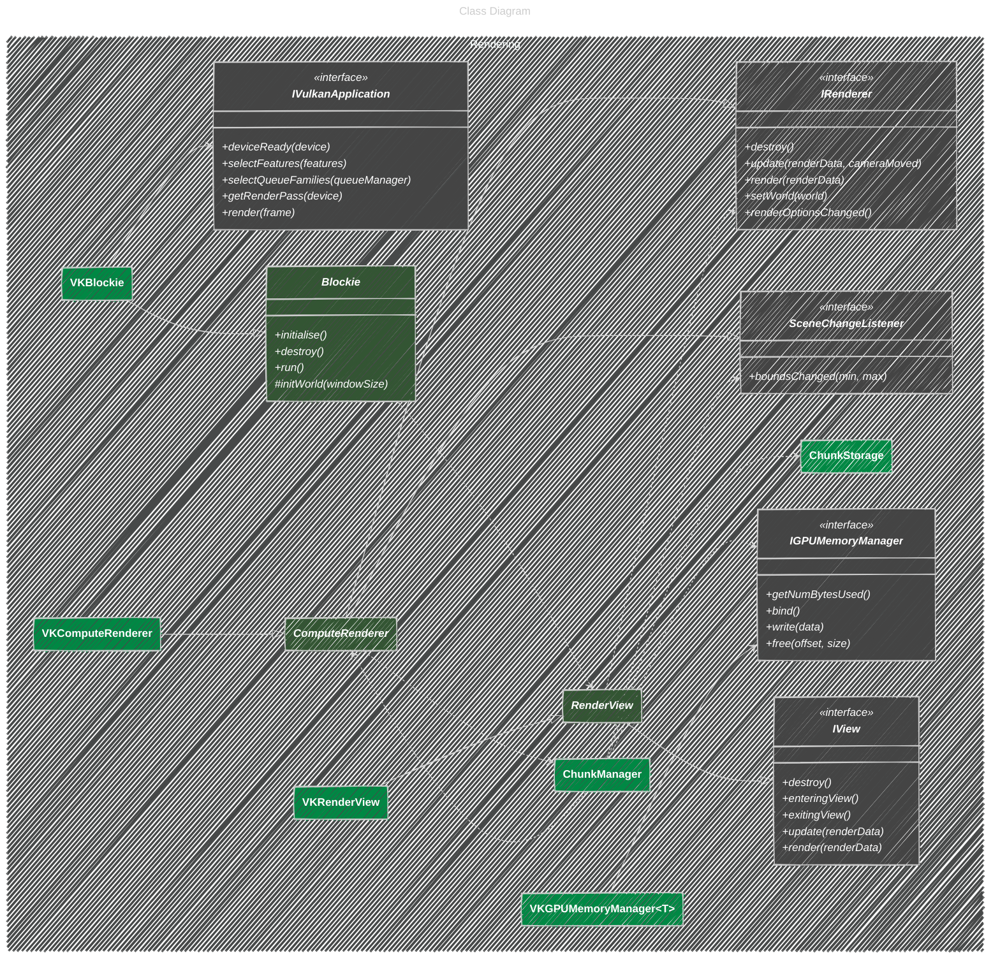

```mermaid
---
  title: Class Diagram
  config:
    theme: dark
    look: handDrawn
    handDrawnSeed: 1000
    class:
      hideEmptyMembersBox: true
---
classDiagram 
direction TD

namespace Rendering {

    class IVulkanApplication:::interface {
        <<interface>>
        +deviceReady(device)
        +selectFeatures(features)
        +selectQueueFamilies(queueManager)
        +getRenderPass(device)
        +render(frame)
    }

    class Blockie:::abstract {
        +initialise() 
        +destroy()
        +run()
        #initWorld(windowSize)
    }

    class VKBlockie {

    }

    class IRenderer:::interface {
        <<interface>>
        +destroy()
        +update(renderData, cameraMoved)
        +render(renderData)
        +setWorld(world)
        +renderOptionsChanged()
    }
    class ComputeRenderer:::abstract {

    }
    class VKComputeRenderer {

    }
    class IGPUMemoryManager:::interface {
        <<interface>>
        +getNumBytesUsed()
        +bind()
        +write(data)
        +free(offset, size)
    }
    class VKGPUMemoryManager~T~ {

    }

    class SceneChangeListener:::interface {
        <<interface>>
        +boundsChanged(min, max)
    }

    class ChunkManager {

    }

    class ChunkStorage {

    }

    class IView:::interface {
        <<interface>>
        +destroy()
        +enteringView()
        +exitingView()
        +update(renderData)
        +render(renderData)
    }
    class RenderView:::abstract {

    }
    class VKRenderView {

    }
}
Blockie ..> RenderView

VKBlockie --|> Blockie
VKBlockie --> IVulkanApplication

ComputeRenderer --|> IRenderer 

VKComputeRenderer --|> ComputeRenderer

ComputeRenderer --|> SceneChangeListener
ComputeRenderer ..> ChunkManager

ChunkManager ..> ComputeRenderer
ChunkManager ..> ChunkStorage
ChunkManager ..> SceneChangeListener
ChunkManager ..> IGPUMemoryManager

VKGPUMemoryManager --> IGPUMemoryManager

RenderView --|> IView
VKRenderView --|> RenderView
RenderView ..> IRenderer

link VKBlockie "https://github.com/pvmoore/Blockie/blob/master/src/blockie/render/vk/VKBlockie.d"

classDef default fill:#084,color:#fff, font-style:bold;
classDef interface fill:#444,color:#fff, font-style:italic;
classDef abstract fill:#353,color:#fff, font-style:italic;
```
