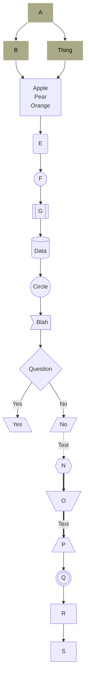
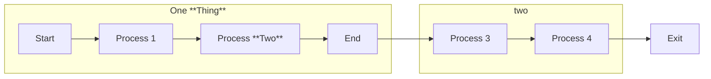
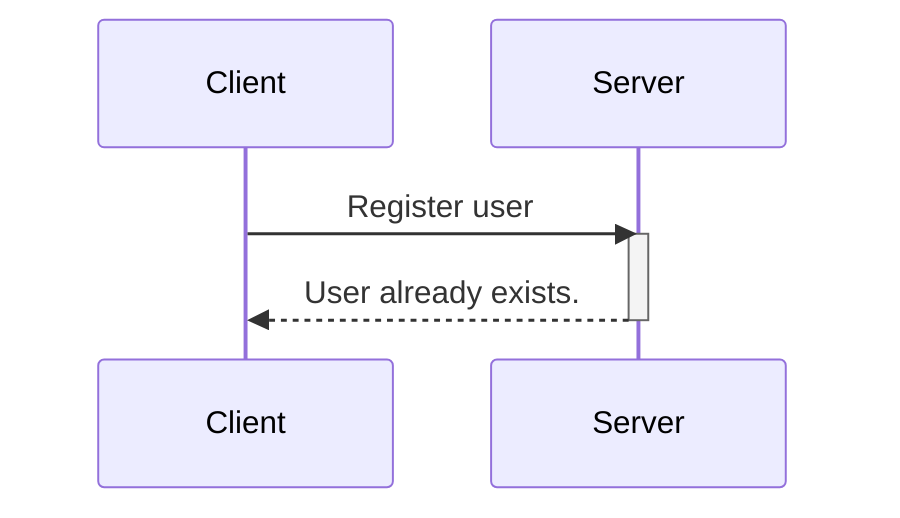
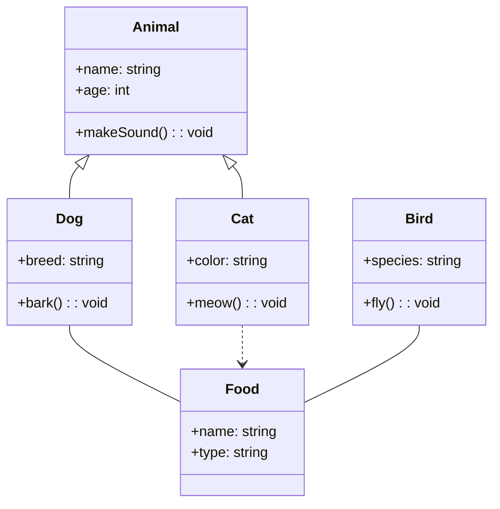
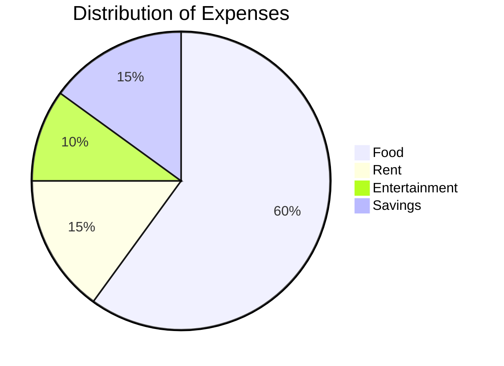

# Mermaid Examples

```mermaid
    info
```

## Orientations
 - TD = Top Down
 - LR = Left to Right
 - BT = Bottom to Top
 - RL = Right to Left

## Flow Chart





## Sequence Diagram



## Class Diagram



## Pie Chart


