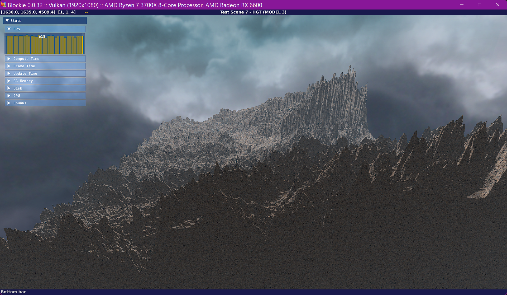
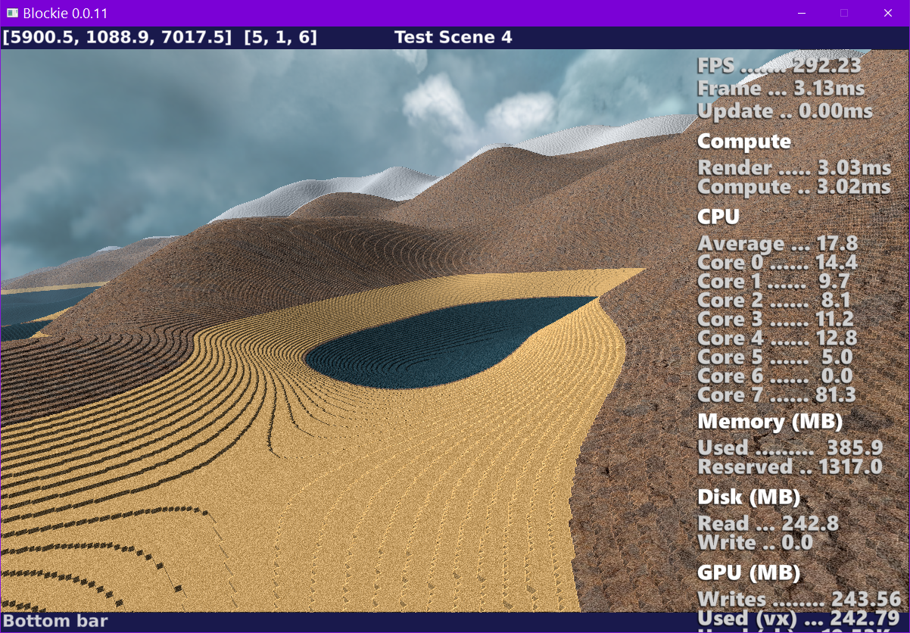
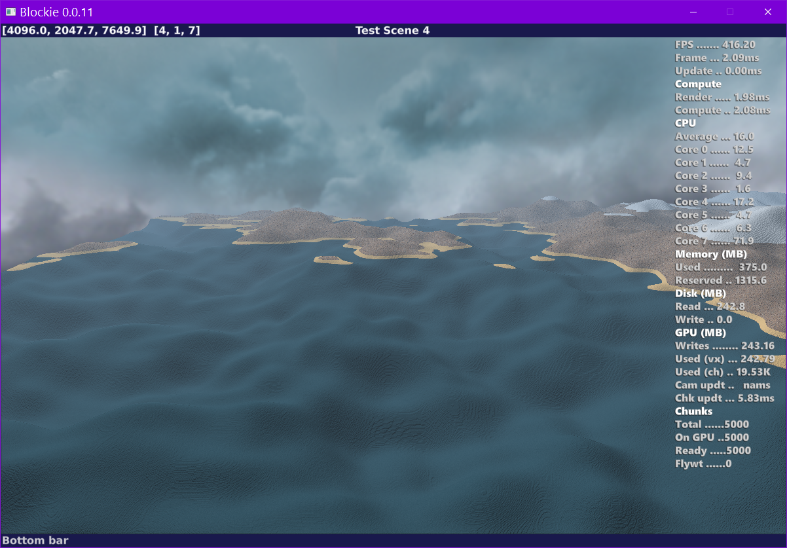
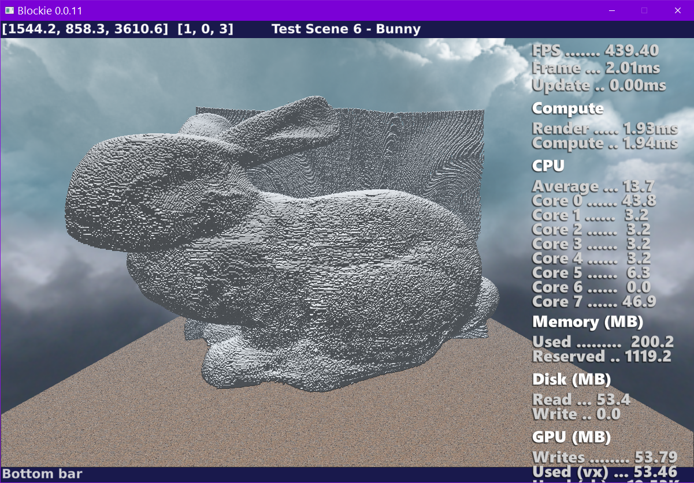

# Blockie

Voxel renderer using Vulkan compute shaders

## Requirements
- Windows
- Dlang https://dlang.org/
- Vulkan Runtime dll (provided by your GPU vendor if supported)
- GLFW dll (provided by dlang-vulkan)
- CImgui dll (provided by dlang-vulkan)
- https://github.com/pvmoore/dlang-vulkan
- https://github.com/pvmoore/dlang-common
- https://github.com/pvmoore/dlang-logging
- https://github.com/pvmoore/dlang-maths
- https://github.com/pvmoore/dlang-fonts
- https://github.com/pvmoore/dlang-events
- https://github.com/pvmoore/dlang-resources

## Features
- Sparse voxel octrees
- 1024³ voxel chunks
- Asynchronous chunk loading
- Opengl compute shader 2-pass renderer
    - 1st pass ... Ray caster that computes hit distances
    - 2nd pass ... Shader that calculates colour/texture/lighting
- Currently no secondary shadow rays are used

## Version History

#### 0.0.32
- Use Imgui for UI

##### 0.0.31
- Remove OpenGL renderer

##### 0.0.30
- Add Model3b which is described in blockie.generate.model.model3b.md
- Add 'useful_functions.comp' code to the project as these functions would not have been
      visible to anyone other than myself

##### 0.0.29
 - Write skybox pixels within the shade shader when a ray misses all scenery instead of as a separate renderer

##### 0.0.28
 - Complete Vulkan implementation
 - Add skybox textures

##### 0.0.27
- Refactor stats monitors to isolate opengl specific code.
- More refactoring to isolate OpenGL functionality
- Move statistics to stats.md
- Move shader source files into sub folders march/ or shade/
- Initial Vulkan version is working. There is still a glitch when the chunk boundary changes which
  needs to be optimised

##### 0.0.26
- Lots of package tidying and moving modules around. Separate render from generate.

##### 0.0.25
- Add CPU and GPU name to title bar.
- Add MODEL6 (partial)
- Refactor some directores
- Start to isolate OpenGL (Adding a Vulkan implementation in the future)

##### 0.0.24
- Tidy up Model3 march shader.

##### 0.0.23
- Move CPU info to bottom of on screen display.
- Add Model 5.
- Fix small bug in Model2/3 chunk optimisation.

##### 0.0.22
- Use monospace font for on screen display. Reformat OSD.
- Distance field optimisation.

###### 0.0.21
- Remove some redundant code in distance calculation.

##### 0.0.20
- Improvements to Model 4

##### 0.0.19
- Implement new Model 4 idea

##### 0.0.18
- Use 6 bytes for chunk distance fields allowing a distance of 255 instead of 15.

##### 0.0.17
- Test speed of larger cell distance fields for Model 3. Not much improvement for higher memory usage.

##### 0.0.16
- Use ChunkEditViews when generating distances.

##### 0.0.15
- Tidy up generation.

##### 0.0.14
- Refactor Model1 generation to remove technical debt.

##### 0.0.13
- Add Model 4 which does not use an octree but instead uses arrays of pixels for populated cells. On Hold.

##### 0.0.12
- Add Model 3 which is like Model 2 but using a 5 bit root.

##### 0.0.11
- Tidy up. Remove unused files.
- Refactor domain to a more modular system.
- Add Model2 which only stores boolean information for a voxel ie. whether it
is air or not-air. This is more compact than model1 and also slightly faster.
Obviously another mechanism for material is required for this model unless
you want all voxels to be the same material.
- Rename a lot of files.

##### 0.0.10
- Lots of changes. Great improvment to compute speed and reduction in voxel data size.

