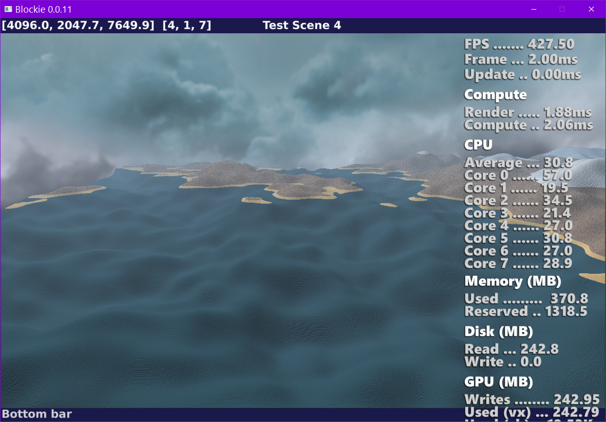
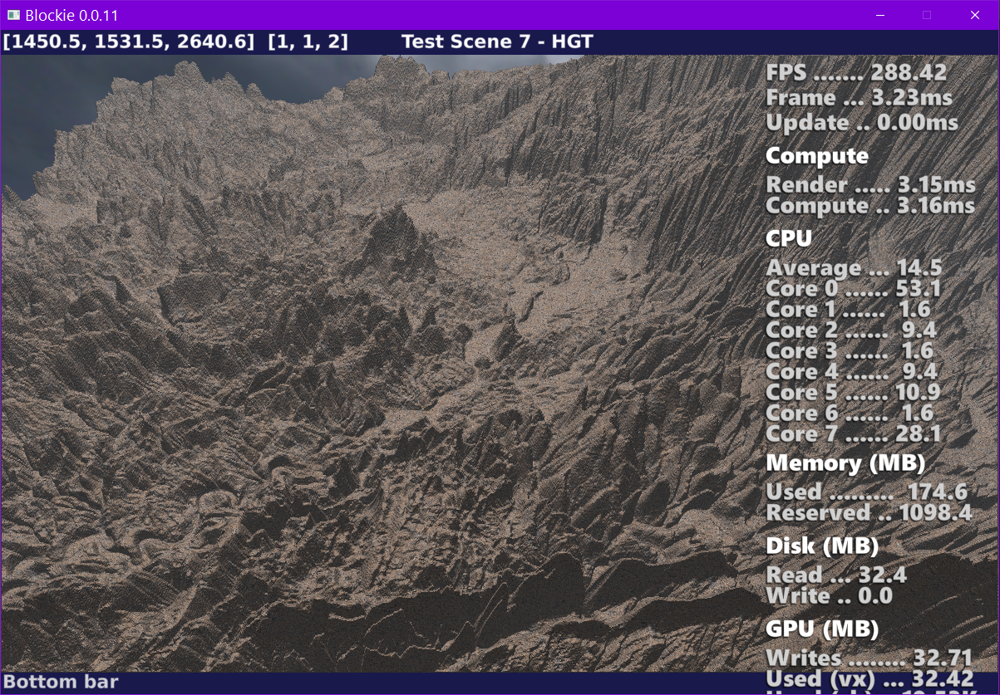

# Blockie

Voxel renderer using Opengl3 compute shaders

## Requirements
- Dlang https://dlang.org/
- OpenGL3 

## Features
- Sparse voxel octrees 
- 1024³ voxel chunks
- Asynchronous chunk loading
- Opengl compute shader 2-pass renderer
    - 1st pass ... Ray caster that computes hit distances
    - 2nd pass ... Shader that calculates colour/texture/lighting
- Currently no secondary shadow rays are used    

